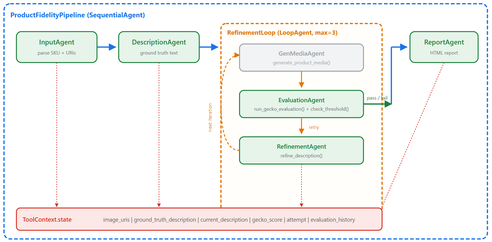

# product-fidelity-eval

This repository demonstrates an automated and scalable framework for standardizing how product catalog assets are generated and evaluated. It uses a flavor of Gecko-based scoring to measure the fidelity of generated assets against the original product references, driving iterative improvements based on those metrics


## Prerequisites

Ensure the project environment, network settings, and service accounts used have the appropriate Google Cloud authentication and permissions to access the following services:

- **Vertex AI API**
- **Cloud Storage API**
- **Artifact Registry**

**Runtime requirements:**

- Python 3.10+
- Node.js v18+ (front-end only)
- Google Cloud authentication (e.g. `gcloud auth application-default login`)

**Python dependencies:**

```bash
pip install -r requirements.txt
```

## Getting Started

Once the prerequisites have been met and the user parameters are specified, users can use the framework using the application, running the agent, or running the notebooks.

### Front-End App

* [app Folder](./app) :

A dashboard with two panels: a GCS image browser on the left and an agent chat on the right. Select a mode, then a product image from GCS or uploaded locally, click Evaluate, and watch the agent pipeline run in real time.

While Agent Mode supports interactive, human-in-the-loop evaluation of individual products, Batch Mode provides an automated offline option. The user points to a GCS bucket containing product reference images, selects which images to process (or checks a box to run the full bucket), and the system feeds all selected images through the existing evaluation pipeline asynchronously.


#### Running the App

**1. Install front-end dependencies:**

```bash
cd app
npm install
```

**2. Start the backend server (terminal 1):**

```bash
uvicorn server:app --host 0.0.0.0 --port 8000 --reload
```

**3. Start the front-end dev server (terminal 2):**

```bash
cd app
npm run dev
```

The app opens at [http://localhost:3000](http://localhost:3000).

**4. Using the app:**

1. Enter a GCS prefix in the search bar (e.g. `gs://your-bucket/product-images/`) and click **Browse**
2. Click an image to select it
3. Click **Evaluate** to send the image to the agent for fidelity evaluation
4. Watch the agent response stream in the chat panel on the right
5. You can also type free-form messages in the chat input

### Agent

* [product_fidelity_agent Folder](./product_fidelity_agent) :
A multi-agent pipeline built on Google ADK that generates product images (or videos) and evaluates their fidelity against the original using Gecko scoring. Products that fail the threshold are automatically retried (up to N times) with refined descriptions, and/or flagged for human review, with results aggregated into a final report.



  - For Each Product - outer loop container with Root Agent
  - Sequence Agent - wraps the sequential workflow containing:
    - Step 1: Parallel Agent - runs both description and image/video generation concurrently
    - Step 2: Product Fidelity Evaluation Agent - scores with Gecko
    - Threshold decision - routes to pass/retry/fail
    - Retry loop - feeds back to generation with refined description
  - Final Report - aggregates all results

The agent supports both image and video evaluation pipelines. See the [agent README](./product_fidelity_agent/README.md) for architecture details, state flow, and video-specific agents.

### Notebooks

* [notebooks/product_fidelity_eval.ipynb](./notebooks/product_fidelity_eval.ipynb) — Walks through assessing product **image** fidelity by using Gemini to create a detailed ground-truth description of a reference image, which then serves as the prompt for the rubric-based Gecko evaluation metric to score candidate images.

* [notebooks/product_fidelity_eval_video.ipynb](./notebooks/product_fidelity_eval_video.ipynb) — Extends the same approach to **video** assets, using Gecko to evaluate candidate videos generated from reference product images via Veo.

### Report

The pipeline results include a report where users can review verdicts for attributes of the product.


### References

- [Google ADK](https://github.com/google/adk-python)
- [Gecko](https://arxiv.org/abs/2404.16820))
